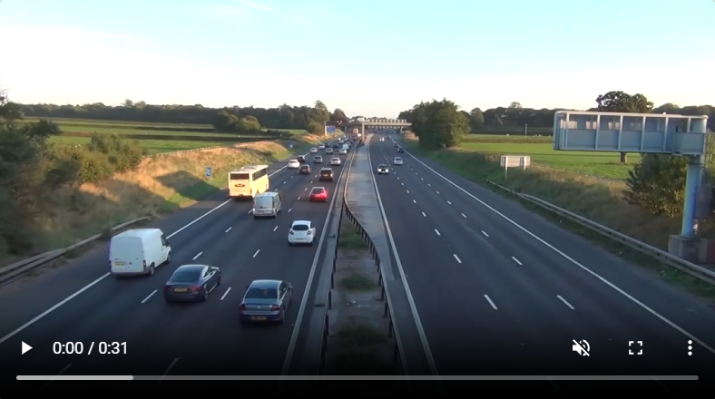
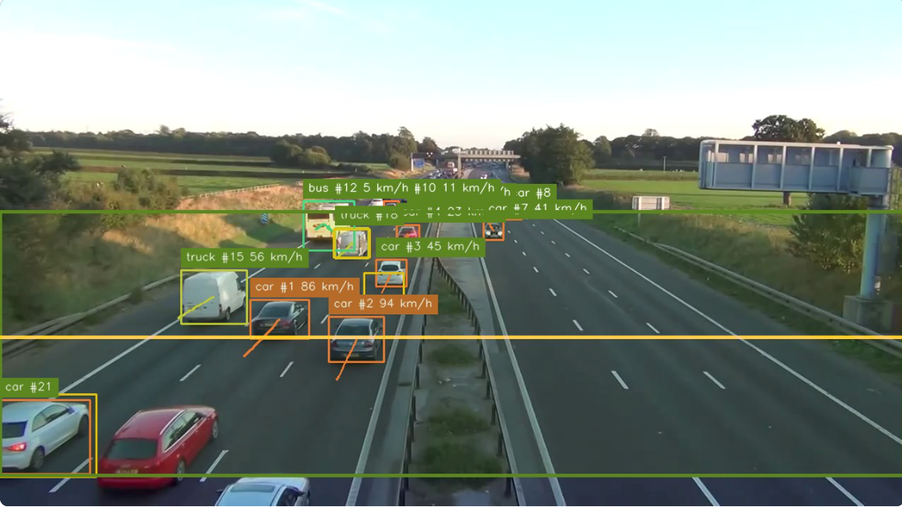
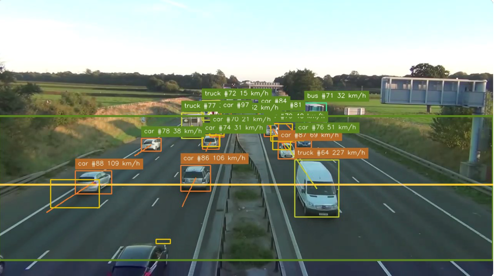
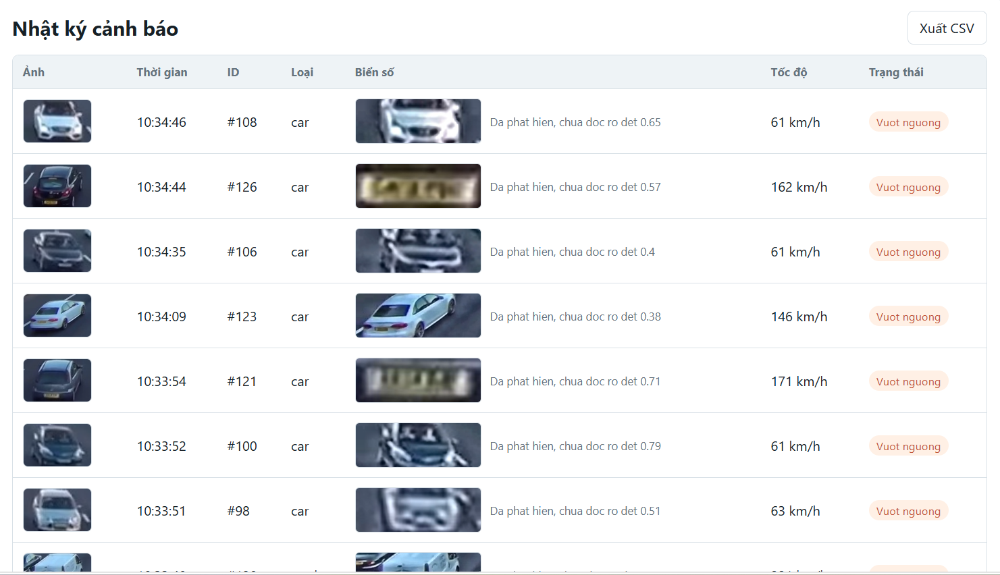
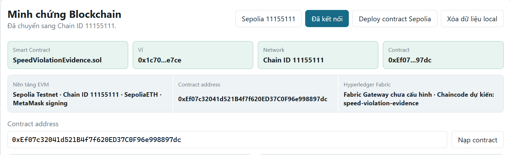
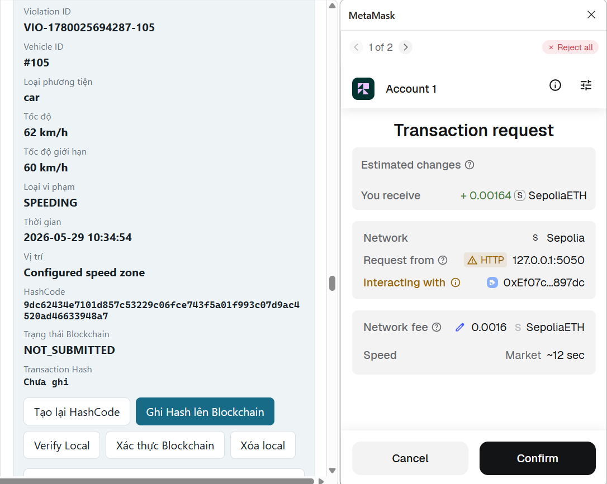
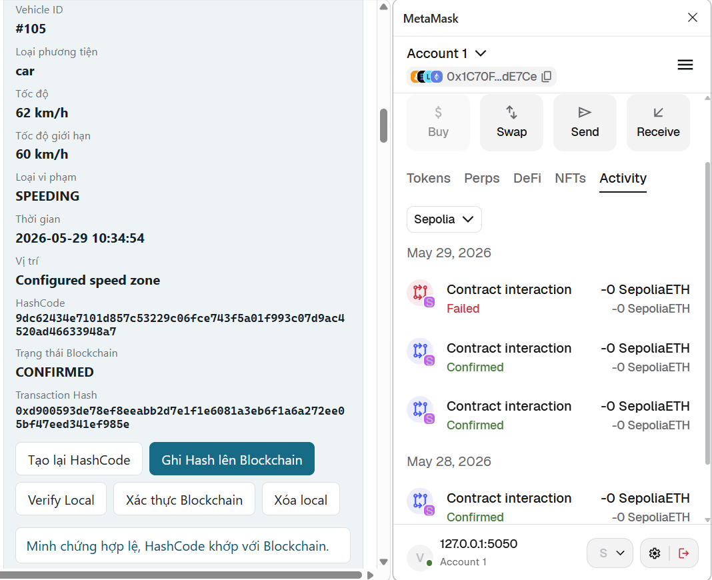

<h2 align="center">
    <a href="https://dainam.edu.vn/vi/khoa-cong-nghe-thong-tin">
    🎓 Faculty of Information Technology - Dai Nam University
    </a>
</h2>

<h2 align="center">
   ỨNG DỤNG BLOCKCHAIN TRONG NHẬN DIỆN PHƯƠNG TIỆN, ƯỚC LƯỢNG TỐC ĐỘ XE VÀ XÁC THỰC DỮ LIỆU GIAO THÔNG
</h2>

<div align="center">
    <p align="center">
        
        
        
    </p>

[](https://www.facebook.com/DNUAIoTLab)
[](https://dainam.edu.vn/vi/khoa-cong-nghe-thong-tin)
[](https://dainam.edu.vn)

</div>

---

## 📖 1. Giới thiệu hệ thống

Hệ thống **nhận diện phương tiện, ước lượng tốc độ xe và xác thực dữ liệu giao thông bằng Blockchain** là một mô hình kết hợp giữa **xử lý ảnh**, **thị giác máy tính**, **trí tuệ nhân tạo** và **công nghệ Blockchain**.

Hệ thống sử dụng video giao thông hoặc camera làm đầu vào, sau đó áp dụng mô hình **YOLO** để phát hiện phương tiện như ô tô, xe máy, xe tải, xe buýt. Sau khi phương tiện được phát hiện, thuật toán tracking sẽ gán ID cho từng xe và theo dõi vị trí của xe qua nhiều khung hình để tính toán tốc độ di chuyển.

Khi phát hiện phương tiện vượt quá tốc độ cho phép, hệ thống sẽ tạo bản ghi dữ liệu gồm ID phương tiện, loại xe, tốc độ, thời gian, vị trí camera và trạng thái vi phạm. Dữ liệu này được tạo mã băm và ghi nhận lên **Smart Contract** thông qua ví **MetaMask**, giúp đảm bảo tính toàn vẹn, minh bạch và chống chỉnh sửa dữ liệu giao thông.

---

## 🎯 2. Mục tiêu đề tài

- Xây dựng hệ thống xử lý video giao thông từ camera hoặc file video.
- Nhận diện phương tiện bằng mô hình YOLO.
- Theo dõi phương tiện qua nhiều khung hình bằng thuật toán tracking.
- Ước lượng tốc độ xe dựa trên quãng đường và thời gian.
- Hiển thị ID xe, loại phương tiện và tốc độ trực tiếp trên video.
- Phát hiện phương tiện vượt quá tốc độ cho phép.
- Tạo bản ghi dữ liệu vi phạm giao thông.
- Tạo mã băm dữ liệu để kiểm chứng.
- Kết nối ví MetaMask để xác thực người quản trị.
- Ghi mã băm dữ liệu lên Smart Contract.
- Kiểm chứng dữ liệu giao thông bằng Blockchain.

---

## ⚙️ 3. Chức năng chính

### 🚗 Nhận diện phương tiện

- Đọc video giao thông từ camera hoặc file video.
- Phát hiện phương tiện bằng mô hình YOLO.
- Nhận diện các loại phương tiện như:
  - Ô tô
  - Xe máy
  - Xe tải
  - Xe buýt
- Vẽ khung nhận diện trực tiếp trên video.
- Hiển thị nhãn phương tiện và độ tin cậy.

### 📌 Theo dõi phương tiện

- Gán ID riêng cho từng phương tiện.
- Theo dõi vị trí xe qua nhiều khung hình.
- Lưu lại lịch sử di chuyển của từng xe.
- Hạn chế nhầm lẫn giữa nhiều phương tiện khác nhau.
- Làm cơ sở để tính tốc độ xe.

### 🚦 Ước lượng tốc độ xe

- Tính khoảng cách di chuyển của xe theo pixel.
- Quy đổi khoảng cách pixel sang khoảng cách thực tế.
- Tính thời gian xe di chuyển giữa các khung hình.
- Tính tốc độ theo đơn vị km/h.
- Hiển thị tốc độ trực tiếp trên giao diện video.

### ⚠️ Phát hiện vi phạm tốc độ

- Thiết lập ngưỡng tốc độ cho phép.
- So sánh tốc độ xe với ngưỡng cài đặt.
- Đánh dấu xe vượt tốc độ.
- Tạo bản ghi dữ liệu vi phạm.
- Lưu thông tin phục vụ kiểm chứng sau này.

### 🔐 Xác thực dữ liệu bằng Blockchain

- Tạo mã băm từ dữ liệu tốc độ xe.
- Ghi mã băm lên Smart Contract.
- Sử dụng MetaMask để ký giao dịch.
- Lưu địa chỉ ví người gửi dữ liệu.
- Kiểm chứng dữ liệu sau khi lưu.
- Phát hiện dữ liệu bị chỉnh sửa hoặc giả mạo.

---

## 🛠️ 4. Công nghệ sử dụng

| Công nghệ | Vai trò |
|----------|---------|
| Python | Xử lý video, nhận diện phương tiện, tính tốc độ |
| OpenCV | Đọc video, xử lý ảnh, vẽ khung nhận diện |
| YOLO | Phát hiện phương tiện giao thông |
| NumPy | Tính toán tọa độ, khoảng cách và vận tốc |
| Tracking Algorithm | Gán ID và theo dõi phương tiện |
| Flask / Web App | Xây dựng giao diện quản lý hệ thống |
| Solidity | Viết Smart Contract |
| Ethereum / EVM Blockchain | Lưu mã băm dữ liệu giao thông |
| MetaMask | Ký giao dịch và xác thực người quản trị |
| Web3.js / Ethers.js | Kết nối ứng dụng Web với Blockchain |
| IPFS / Off-chain Storage | Lưu dữ liệu gốc hoặc ảnh bằng chứng ngoài chuỗi |

---

## 🧠 5. Mô hình hoạt động của hệ thống

Quy trình xử lý tổng quát:

```text
Camera / Video giao thông
        ↓
OpenCV đọc từng khung hình
        ↓
YOLO phát hiện phương tiện
        ↓
Tracking gán ID cho từng xe
        ↓
Tính toán tốc độ xe
        ↓
Kiểm tra vượt tốc độ
        ↓
Tạo bản ghi dữ liệu vi phạm
        ↓
Tạo mã băm dữ liệu
        ↓
MetaMask ký giao dịch
        ↓
Smart Contract lưu mã băm
        ↓
Kiểm chứng dữ liệu bằng Blockchain
```

---

## 🔁 6. Quy trình xử lý chi tiết

### Bước 1: Thu nhận video

Hệ thống nhận dữ liệu đầu vào từ camera giao thông hoặc file video có sẵn. Camera cần được đặt ở vị trí phù hợp để quan sát rõ mặt đường và phương tiện.

### Bước 2: Phát hiện phương tiện

Mỗi khung hình được đưa vào mô hình YOLO để phát hiện phương tiện. Kết quả trả về gồm tọa độ khung bao, nhãn phương tiện và độ tin cậy.

### Bước 3: Theo dõi xe

Thuật toán tracking gán ID riêng cho từng xe, giúp hệ thống biết được cùng một phương tiện đang di chuyển qua nhiều khung hình khác nhau.

### Bước 4: Tính tốc độ

Tốc độ được tính dựa trên sự thay đổi vị trí của xe theo thời gian.

Công thức tổng quát:

```text
Tốc độ = Quãng đường / Thời gian
```

Đổi sang đơn vị km/h:

```text
v(km/h) = v(m/s) × 3.6
```

### Bước 5: Phát hiện vi phạm

Nếu tốc độ của xe vượt quá ngưỡng cho phép, hệ thống sẽ đánh dấu xe vi phạm và tạo bản ghi dữ liệu.

### Bước 6: Tạo mã băm dữ liệu

Bản ghi dữ liệu gồm:

```json
{
  "vehicleId": "CAR_001",
  "vehicleType": "car",
  "speed": "72 km/h",
  "time": "2025-05-26 10:30:00",
  "cameraLocation": "Camera_01",
  "violationStatus": "Over Speed"
}
```

Sau đó hệ thống tạo mã băm để phục vụ kiểm chứng.

### Bước 7: Ghi dữ liệu lên Blockchain

Người quản trị kết nối ví MetaMask và ký giao dịch. Mã băm dữ liệu được gửi đến Smart Contract để lưu trữ trên Blockchain.

### Bước 8: Kiểm chứng dữ liệu

Khi cần kiểm tra, hệ thống tạo lại mã băm từ dữ liệu hiện tại và so sánh với mã băm đã lưu trên Smart Contract.

- Nếu mã băm trùng nhau: dữ liệu chưa bị chỉnh sửa.
- Nếu mã băm khác nhau: dữ liệu có thể đã bị thay đổi hoặc giả mạo.

---

## 🧾 7. Thiết kế Smart Contract

Smart Contract có nhiệm vụ lưu trữ mã băm dữ liệu tốc độ xe và hỗ trợ kiểm chứng dữ liệu.

Một bản ghi có thể gồm:

```solidity
struct VehicleRecord {
    uint256 recordId;
    string dataHash;
    address sender;
    uint256 timestamp;
    string status;
}
```

Các chức năng chính:

- `storeVehicleRecord`: lưu mã băm dữ liệu tốc độ xe.
- `verifyVehicleRecord`: kiểm tra mã băm dữ liệu.
- `getVehicleRecord`: truy xuất thông tin bản ghi.
- `checkOwner`: kiểm tra người gửi dữ liệu.
- `updateStatus`: cập nhật trạng thái bản ghi nếu có quyền.

---

## 🚀 8. Hướng dẫn cài đặt và sử dụng

### Yêu cầu môi trường

Cài đặt các công cụ sau:

- Python 3.9 trở lên
- Git
- Node.js
- MetaMask Extension
- Visual Studio Code
- Trình duyệt Chrome hoặc Edge
- Ganache, Hardhat hoặc mạng testnet Ethereum

---

### Bước 1: Clone source code

```bash
git clone https://github.com/your-username/vehicle-speed-blockchain.git
cd vehicle-speed-blockchain
```

---

### Bước 2: Cài đặt thư viện Python

```bash
pip install -r requirements.txt
```

Một số thư viện cần có:

```bash
pip install ultralytics opencv-python numpy flask
```

---

### Bước 3: Chạy hệ thống nhận diện xe

```bash
python app.py
```

Hoặc nếu dùng file xử lý riêng:

```bash
python detect_speed.py
```

---

### Bước 4: Cài đặt phần Blockchain

```bash
cd blockchain
npm install
```

---

### Bước 5: Biên dịch Smart Contract

```bash
npx hardhat compile
```

---

### Bước 6: Deploy Smart Contract

```bash
npx hardhat run scripts/deploy.js --network localhost
```

Hoặc deploy lên testnet:

```bash
npx hardhat run scripts/deploy.js --network sepolia
```

---

### Bước 7: Chạy giao diện Web

```bash
cd frontend
npm install
npm run dev
```

---

### Bước 8: Kết nối MetaMask

- Mở trình duyệt.
- Cài đặt MetaMask.
- Import ví hoặc tạo ví mới.
- Kết nối với mạng Blockchain đang sử dụng.
- Truy cập giao diện hệ thống.
- Bấm kết nối ví.
- Ký giao dịch khi ghi dữ liệu lên Blockchain.

---

## 🖼️ 9. Hình ảnh minh họa chức năng

### Giao diện video giao thông đầu vào

<p align="center">
    
</p>
<p align="center"><i>Hình 1. Video giao thông đầu vào</i></p>

---

### Nhận diện phương tiện bằng YOLO

<p align="center">
    
</p>
<p align="center"><i>Hình 2. Nhận diện phương tiện bằng YOLO</i></p>

---

### Theo dõi phương tiện bằng ID

<p align="center">
    
</p>
<p align="center"><i>Hình 3. Theo dõi xe bằng ID</i></p>

---

### Ước lượng tốc độ xe

<p align="center">
    
</p>
<p align="center"><i>Hình 4. Ước lượng tốc độ xe</i></p>

---

### Cảnh báo xe vượt tốc độ

<p align="center">
    
</p>
<p align="center"><i>Hình 5. Cảnh báo phương tiện vượt tốc độ</i></p>

---

### Kết nối ví MetaMask

<p align="center">
    
</p>
<p align="center"><i>Hình 6. Kết nối ví MetaMask</i></p>

---

### Ghi mã băm lên Blockchain

<p align="center">
    
</p>
<p align="center"><i>Hình 7. Ghi mã băm dữ liệu lên Blockchain</i></p>

---

### Kiểm chứng dữ liệu giao thông

<p align="center">
    
</p>
<p align="center"><i>Hình 8. Kiểm chứng dữ liệu tốc độ xe</i></p>

---

## 📊 10. Kết quả đạt được

Hệ thống sau khi xây dựng có thể thực hiện các chức năng sau:

- Nhận diện được phương tiện trong video giao thông.
- Theo dõi từng phương tiện bằng ID riêng.
- Tính toán và hiển thị tốc độ xe.
- Phát hiện phương tiện vượt quá tốc độ cho phép.
- Tạo bản ghi dữ liệu vi phạm.
- Tạo mã băm dữ liệu để chống chỉnh sửa.
- Kết nối ví MetaMask để xác thực người quản trị.
- Ghi mã băm dữ liệu lên Smart Contract.
- Kiểm chứng dữ liệu giao thông bằng Blockchain.

---

## ✅ 11. Ưu điểm

- Tự động hóa quá trình giám sát giao thông.
- Có thể nhận diện và theo dõi phương tiện gần thời gian thực.
- Hỗ trợ phát hiện xe vượt tốc độ.
- Dữ liệu vi phạm có thể được kiểm chứng bằng Blockchain.
- Hạn chế nguy cơ chỉnh sửa hoặc giả mạo dữ liệu.
- MetaMask giúp xác thực người gửi dữ liệu.
- Có thể mở rộng thêm nhận diện biển số xe.

---

## ⚠️ 12. Hạn chế

- Độ chính xác tốc độ phụ thuộc vào góc đặt camera.
- Cần hiệu chuẩn khoảng cách thực tế để tính tốc độ chính xác.
- Ánh sáng yếu, mưa hoặc vật cản có thể ảnh hưởng đến nhận diện.
- Khi nhiều xe che khuất nhau, thuật toán tracking có thể nhầm ID.
- Blockchain có thể phát sinh chi phí giao dịch.
- Không nên lưu trực tiếp video hoặc ảnh gốc lên Blockchain.

---

## 🔮 13. Hướng phát triển

Trong tương lai, hệ thống có thể được phát triển thêm các chức năng:

- Nhận diện biển số xe.
- Tích hợp IPFS để lưu ảnh vi phạm ngoài chuỗi.
- Xây dựng dashboard thống kê giao thông.
- Phát hiện thêm hành vi vi phạm như vượt đèn đỏ, đi sai làn.
- Tối ưu mô hình YOLO để chạy trên thiết bị nhúng.
- Triển khai Smart Contract trên mạng Sepolia hoặc Polygon Amoy.
- Kết nối cơ sở dữ liệu để lưu lịch sử phương tiện.
- Cải thiện hiệu chuẩn camera bằng Perspective Transform.

---

## 📁 14. Cấu trúc thư mục đề xuất

```text
vehicle-speed-blockchain/
│
├── app.py
├── detect_speed.py
├── requirements.txt
├── README.md
│
├── models/
│   └── yolov8n.pt
│
├── videos/
│   └── traffic_video.mp4
│
├── outputs/
│   ├── result_video.mp4
│   └── violations/
│
├── blockchain/
│   ├── contracts/
│   │   └── VehicleRecord.sol
│   ├── scripts/
│   │   └── deploy.js
│   ├── hardhat.config.js
│   └── package.json
│
├── frontend/
│   ├── src/
│   ├── package.json
│   └── index.html
│
└── docs/
    ├── aiotlab_logo.png
    ├── fitdnu_logo.png
    ├── dnu_logo.png
    ├── input_video.png
    ├── yolo_detection.png
    ├── tracking_id.png
    ├── speed_estimation.png
    ├── violation_alert.png
    ├── metamask_connect.png
    ├── blockchain_hash.png
    └── verify_data.png
```

---

## 📌 15. Lưu ý sử dụng

- Cần đặt camera ở vị trí cố định để tính tốc độ chính xác hơn.
- Nên hiệu chuẩn khoảng cách thực tế trên mặt đường trước khi chạy hệ thống.
- Không lưu toàn bộ video lên Blockchain vì dung lượng lớn và chi phí cao.
- Blockchain chỉ nên lưu mã băm dữ liệu để kiểm chứng.
- Dữ liệu gốc nên lưu ngoài chuỗi bằng cơ sở dữ liệu hoặc IPFS.
- Cần kiểm tra đúng địa chỉ Smart Contract trước khi gửi giao dịch.
- MetaMask cần được kết nối đúng mạng Blockchain đang sử dụng.

---

## 👨‍💻 16. Thông tin sinh viên

**Họ và tên:** Bùi Tuấn Dương  
**Mã sinh viên:** 1671020071  
**Lớp:** CNTT 16-03  
**Khoa:** Công nghệ thông tin  
**Trường:** Đại học Đại Nam  
**Email:** buibanh2k4@gmail.com  

---

## 📚 17. Tài liệu tham khảo

- OpenCV Documentation
- Ultralytics YOLO Documentation
- Ethereum Documentation
- MetaMask Documentation
- Solidity Documentation
- Bitcoin Whitepaper - Satoshi Nakamoto
- Ethereum Whitepaper - Vitalik Buterin

---

© 2025 AIoTLab, Faculty of Information Technology, Dai Nam University. All rights reserved.